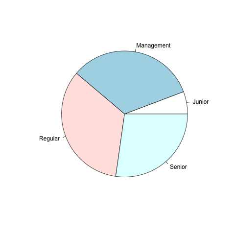
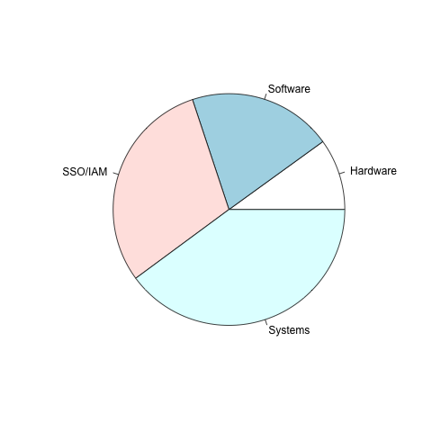
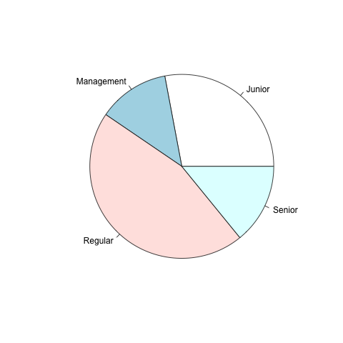

```{r setup, include=FALSE}
knitr::opts_chunk$set(echo = TRUE)

# https://docs.google.com/document/d/1Sq2-7n91B3uizeUHAreKzmJ1PPUsmP7oktAV875UBNo/preview#heading=h.ctpd18l06yte
```

## Research Question

Primary Question: What ticket characteristics are most helpful in predicting whether or not a ticket was escalated? How can we predict which tickets are/are not escalated? In other words, what tickets are most likely to be escalated?

## Narrative

Title: Internal Hierarchy: Seniority Matters

Our research aims to determine what factors contribute to whether or not an IT Help Desk ticket is escalated, that is, how can we predict which tickets are/are not escalated? Our preliminary investigation found that submitter seniority and ticket category were strong predictors for a ticket's escalation status. 

Out of 100,000 tickets, 35,699 (36%) were escalated. Of those tickets,

- 3,566 (9.9%) were categorized as Hardware,
- 7,119 (19.2%) were categorized as Software,
- 10,624 (29.7%) were categorized as SSO/IAM; and,
- 14,390 (40.3%) were categorized as Systems.

If we group by submitter seniority, then:

- 2,055 (5.7%) were submitted by a junior employee or intern,
- 12,111 (33.9%) were submitted by a regular employee,
- 11,806 (33.1%) were submitted by management; and,
- 9,727 (27.2%) were submitted by senior employees.

I also investigated the breakdown of non-escalated tickets, or tickets that remained in the first line Help Desk queue. Within these non-escalated tickets, the results remained the same for category: The majority of submitted non-escalated tickets are categorized as SSO/IAM and Systems. This indicates that perhaps category is not as strong of a predictor as we had originally thought. Instead, it implies that the majority of all submitted tickets, escalated and non-escalated, are for SSO/IAM and Systems issues. 

However, the breakdown of submitter seniority is significantly different. The majority of the tickets are now submitted by Junior and Regular employees. This matches what we found with escalated tickets. Namely, that tickets submitted by Senior and Management-level employees are more likely to be escalated. 

It may be more helpful to express these raw numbers as pie charts. Looking solely at escalated tickets:

```{r}


```

Thus, the majority of escalated tickets are categorized as systems, and are submitted by regular or management-level employees.

Then, looking solely at non-escalated tickets:
```{r}


```


To answer our research question, I can state that: 

1. The seniority and category of tickets are most helpful in predicting whether or not a ticket has been escalated, but seniority is the most important. 
2. We can predict which tickets are/are not escalated by looking at the category and seniority. If the category is SSO/IAM or Systems, AND the seniority is NOT Junior, then the ticket has likely been escalated. 
3. In summary, tickets categorized as SSO/IAM or Systems AND submitted by non-Junior employees are most likely to be escalated.